# Demi — Agent Context README

> Compressed notation for AI coding agents. Read `§0 Legend` first — every symbol maps to one exact meaning. Precision > prose.

---

## §0 Legend

| Symbol | Meaning |
|---|---|
| `→` | produces / transforms into |
| `⇒` | triggers / causes |
| `⊕` | combined with (both required together) |
| `∥` | runs in parallel with |
| `?` | future / undecided scope, not MVP |
| `!` | MVP-critical |
| `U` | the developer using Demi |
| `R` | a GitHub repo `U` connects |
| `S(U)` | `U`'s declared scope filter (e.g. `frontend`, `auth`, `payments`, a module) |
| `[HITL]` | human-in-the-loop checkpoint — agent must not proceed past this without `U` approval |

---

## §1 What Demi is (one line)

Demi is an AI-powered developer workspace that helps `U` understand an unfamiliar `R`, investigate issues, and coordinate agents to ship changes through pull requests.

**Product thesis:** Demi turns an unfamiliar repo into an understandable, actionable workspace where `U` and AI agents work together to ship changes. Demi owns the *developer experience and workflow* — not any specific AI infrastructure underneath it. Infra is intentionally not locked in yet (§4).

Context: built for **IBM Bob 2.0 Hackathon** (Sep 25–27, 2026), solo dev, Nuxt. Bob IDE is being used to *accelerate building Demi itself* — it is a dev-time tool here, not a required runtime dependency of the product.

## Bob 2.0 Build Sessions

Screenshots from the Bob 2.0 development sessions used to build Demi.

### Authentication & GitHub

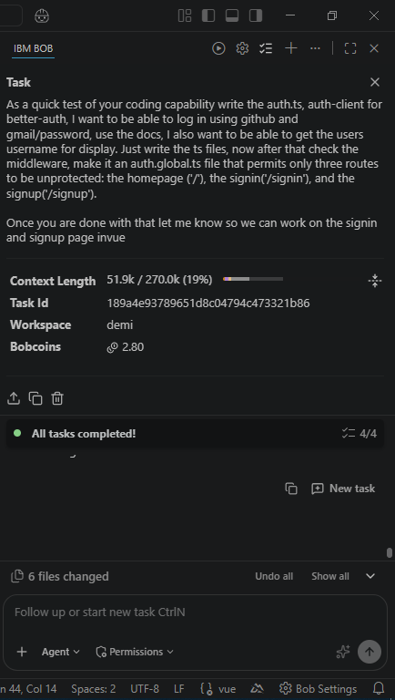

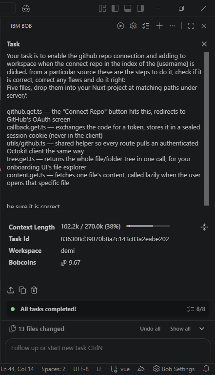

### Core Chat

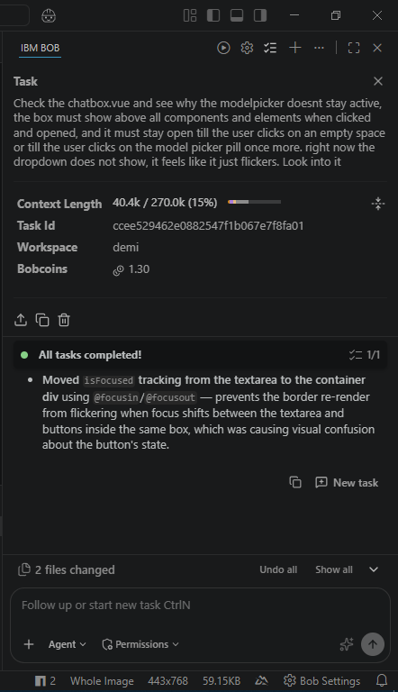

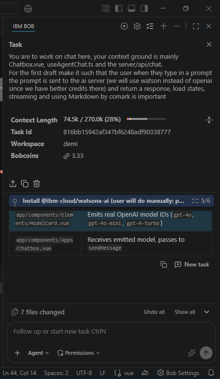

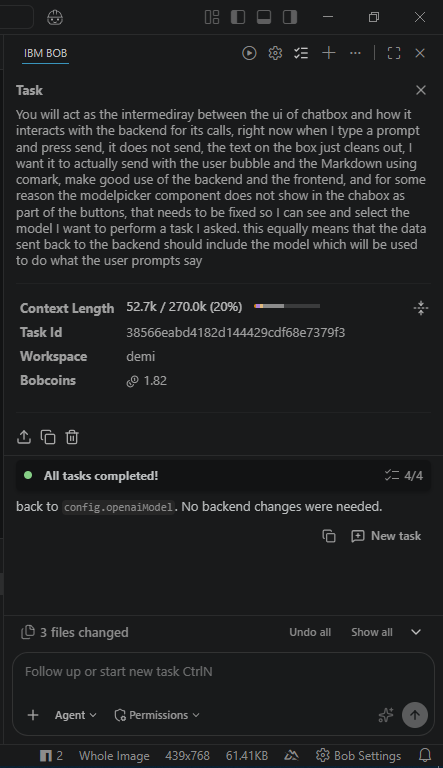

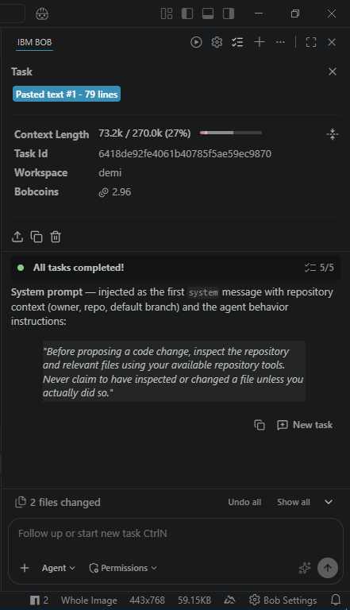

### Workspace & Product UI

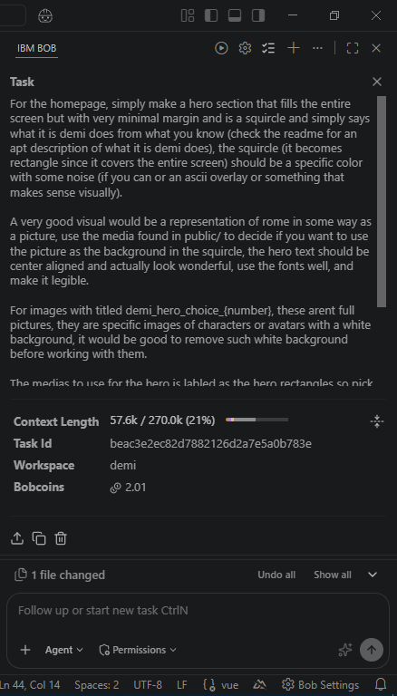

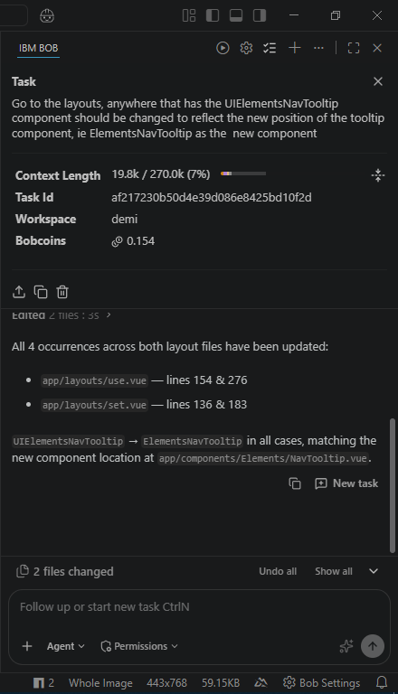

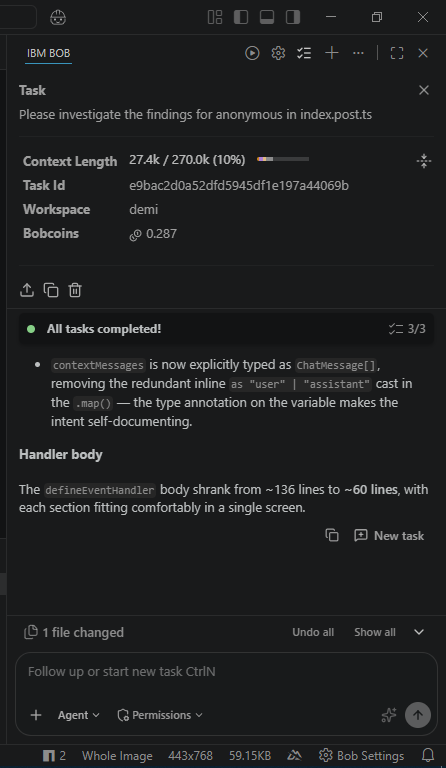

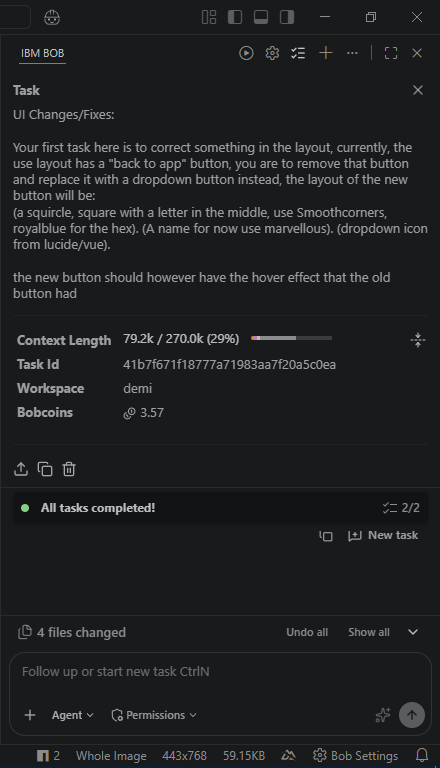

### Sessions & Review

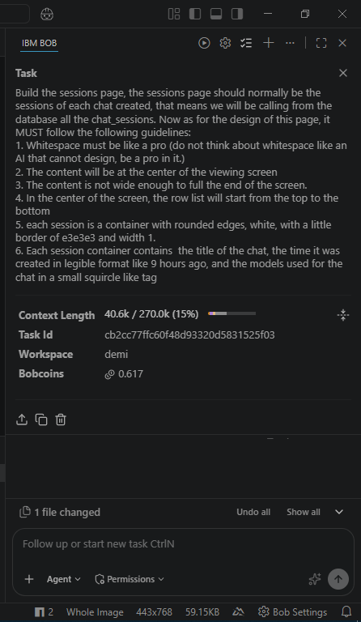

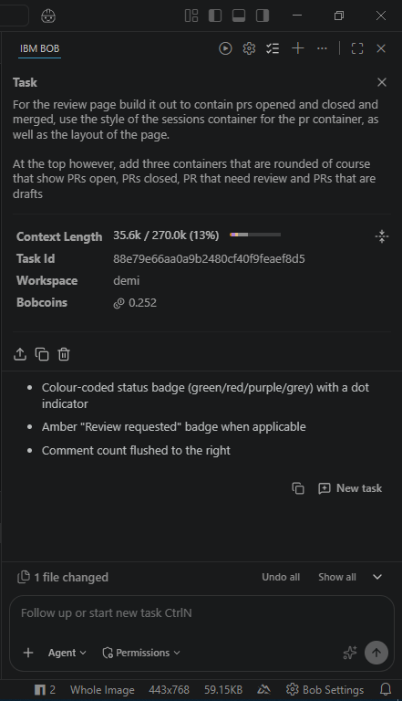

### Storage

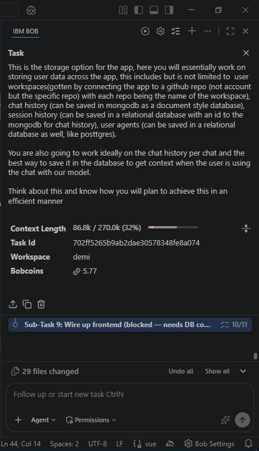

### Structure

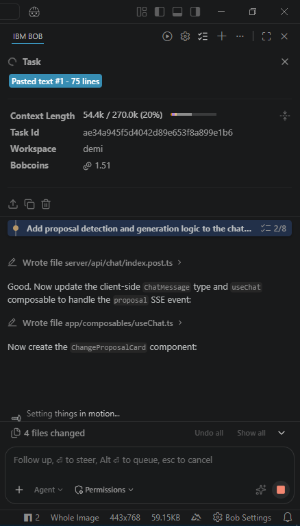

## §2 Core flow

```
connect(R) → understand(R, S(U)) → issues(R, U) → investigate(issue) [HITL] → assign(agent(s)) →
    agent: understand code ⊕ plan ⊕ modify files ⊕ run tests → [HITL] review → [HITL] approve → PR(R)
```

`[HITL]` appears three times deliberately: investigate, review, and approve are all points where `U` stays in control — agents don't merge unsupervised.

## §3 Feature set

- **F1** `!` Codebase onboarding: explain `R` filtered by `S(U)` — architecture, auth, payments, or any specific module `U` cares about right now.
- **F2** `!` Issue workspace: view + investigate issues assigned to `U`, inside Demi (no context-switch to GitHub UI).
- **F3** `!` AI implementation agent: given an issue, agent investigates → understands relevant code → plans a solution → modifies files → runs tests → prepares a PR (does not auto-merge).
- **F4** `!` Multi-agent work: multiple agents on different aspects of a task, concurrently.
- **F5** `!` Human control: `U` monitors agent work in progress, can intervene mid-task, reviews diffs, approves before PR creation. This is a core feature, not a safety afterthought — treat `[HITL]` checkpoints in §2 as required, not optional UX polish.
- **F6** `?` Future monitoring: Demi detects problems in `R` proactively, proposes or creates GitHub issues.

## §4 Infrastructure (deliberately not locked in)

Demi's value = the workflow/UX layer. Everything below is swappable; do not hard-couple F1–F5 logic to one provider's API shape.

| Layer | Status |
|---|---|
| Models | Undecided — OpenAI, watsonx.ai, or another provider. Keep behind one interface, e.g. `generate(prompt, context, tools?): result`, so swapping ≠ rewrite. |
| Agent harness / orchestration | Undecided. Options to evaluate: build directly on a model's tool-calling (lightest), a framework (LangGraph, CrewAI), or watsonx Orchestrate (heaviest setup, only worth it if multi-agent (F4) needs real concurrent orchestration rather than parallel independent calls). |
| Tools available to agents | GitHub API (Octokit) for repo read/write/PR, code execution/test-running sandbox, repo-tooling as needed. |
| Demi's own layer | Nuxt 3 (Vue 3, TS), Nitro server routes for all external calls, Tailwind, Pinia. This layer is the actual product and stays stable regardless of §4 provider choices. |

## §5 Non-negotiables for any agent editing this repo

- Never wire F1–F5 UI/workflow logic directly to a specific model provider's SDK — always through the interface in §4, since the model choice is explicitly undecided.
- Every `[HITL]` checkpoint in §2 must be a real UI gate (not a log line) — investigate, review, and approve are user actions, not agent-internal steps.
- Any agent-modified files must be diffable and attributed to the issue that triggered them, before PR creation.
- Secrets (GitHub token, model API keys) stay server-side (Nitro), never in the client bundle.

## §6 Build order (as agreed)

1. UI first for F1 (onboarding) + F2 (issue workspace) — use Bob to scaffold components, hasten dev time.
2. F3 single-agent, single-issue flow, with all three `[HITL]` gates real (even if agent logic is simple at first).
3. F5 polish — monitoring/intervene UI, since it's a core differentiator, not stretch.
4. F4 (multi-agent) once F3 is demo-stable.
5. F6 only if time remains.